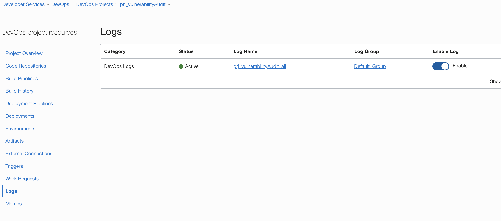
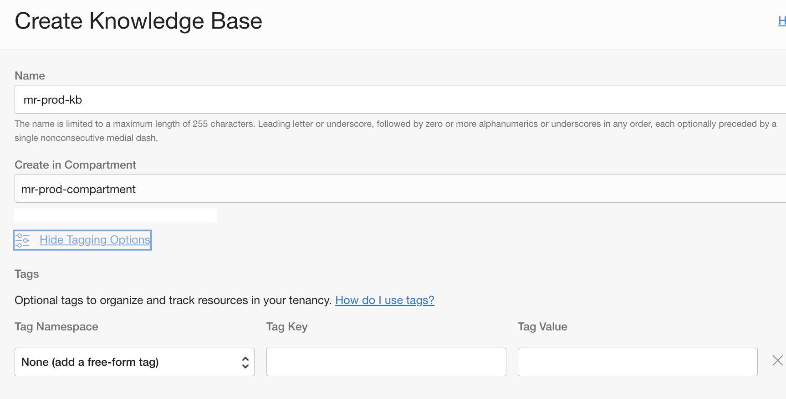
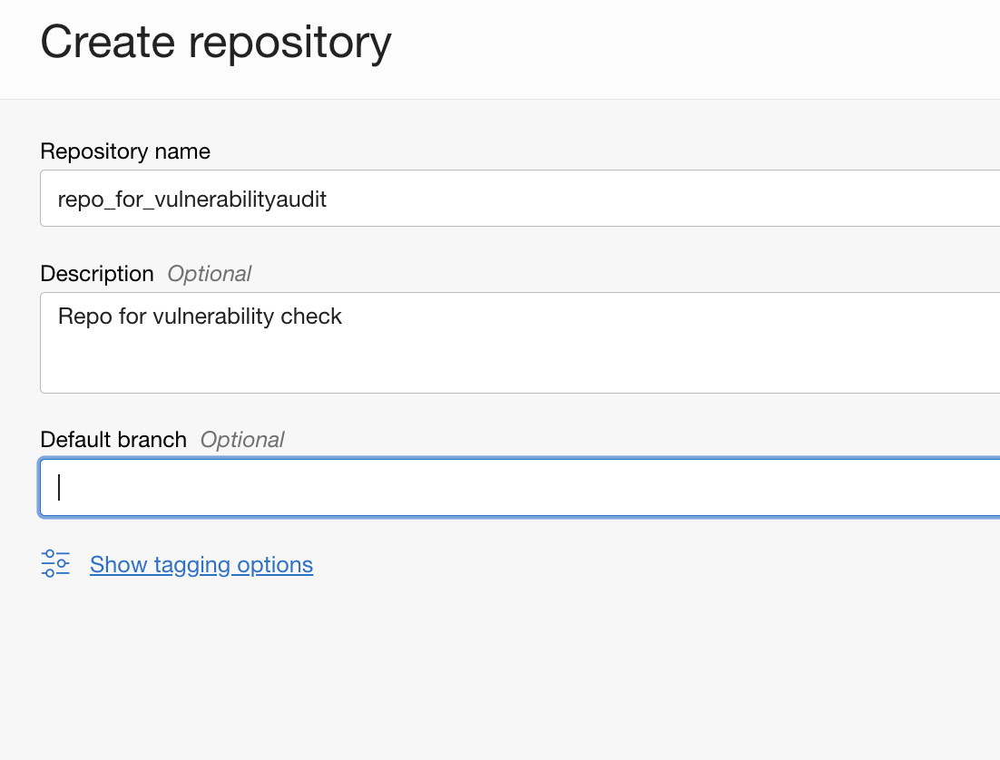
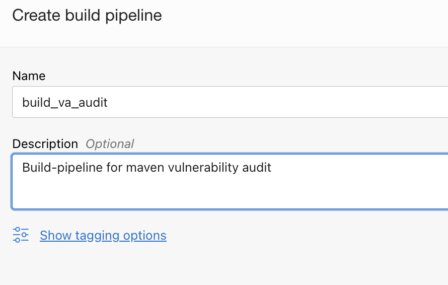
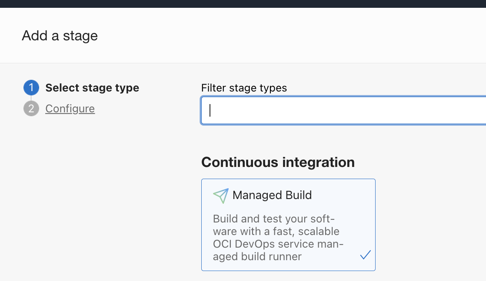
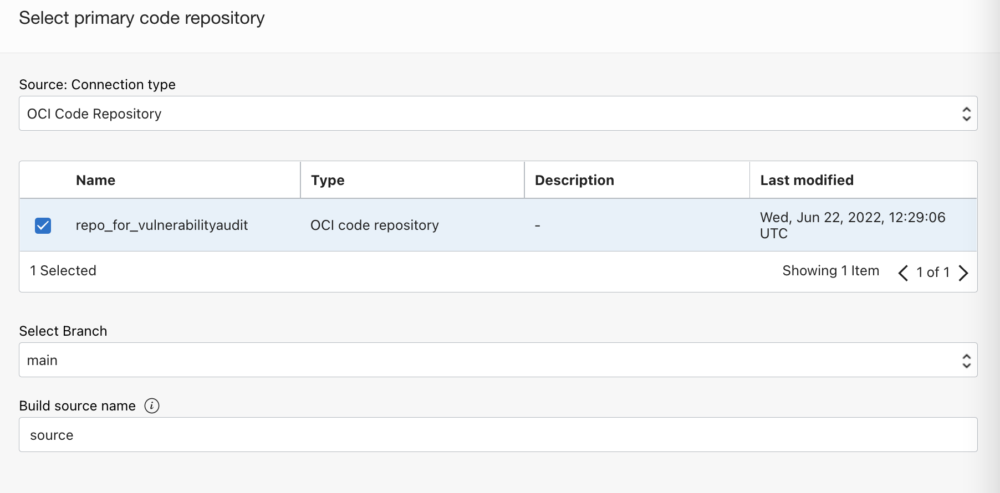

A sample illustration of Code Vulnerabilities for Maven packages 
------

The Application Dependency Management (ADM) service provides you with an integrated vulnerability knowledge base that you can use from the Oracle Cloud Infrastructure (OCI) DevOps build pipelines to detect vulnerabilities in the packages used for the build.


Objective
---

- Create an OCI build pipeline with a sample java - maven based application .
- Instantiate a vulernability scan and demonstrate sucess and failure conditions .

Procedure to use the illustration
-------
- Create an OCI notification topic - https://docs.oracle.com/en-us/iaas/Content/Notification/Tasks/managingtopicsandsubscriptions.htm#createTopic
- Create a devops project - https://docs.oracle.com/en-us/iaas/Content/devops/using/create_project.htm#create_a_project.
- Associate with the notification topic.


- Enable the logging for the devops project.




- Create an OCI Dynamic group and add below rules . - https://docs.cloud.oracle.com/iaas/Content/Identity/Tasks/managingdynamicgroups.htm 

```markdown
ALL {resource.type = 'devopsbuildpipeline', resource.compartment.id = 'COMPARMENT OCID'}

ALL {resource.type = 'devopsrepository', resource.compartment.id = 'COMPARMENT OCID'}
```

- Create an OCI policy and add below policies - https://docs.cloud.oracle.com/iaas/Content/Identity/Concepts/policies.htm

```markdown
Allow dynamic-group "NAME OF THE DynamicGroup" to manage repos in compartment "COMPARTMENT NAME"
Allow dynamic-group  "NAME OF THE DynamicGroup" to use ons-topics in compartment "COMPARTMENT NAME"
```

- Follow below steps and create  a knowledge base - https://docs.oracle.com/en-us/iaas/Content/application-dependency-management/concepts/getting-started.htm 

- In the `Oracle Cloud Console`, open the navigation menu, click `Developer Services`. Under `Application Dependency Management`, click `Knowledge Bases`.
- Click Create Knowledge Base. You are prompted to enter information to describe the new knowledge base.
- Enter the following information:
  - Name: Give the knowledge base a name. For example, "Sample Knowledge Base".
  - Create in Compartment: Select the compartment from the compartment drop-down list.
  - (Optional) Provide a list of one or more unique tag key-value pairs to describe the knowledge base. 
  

- Make a note of the `Knowledge base OCID`.


- Switch back to `OCI Devops Project ` and create an OCI Code repo - https://docs.oracle.com/en-us/iaas/Content/devops/using/create_repo.htm#create_repo



- Push the content to OCI Code repo - https://docs.oracle.com/en-us/iaas/Content/devops/using/clone_repo.htm 

- You may use other support version control repos as well (like Github.com,Bitbucket.com,Bitbucket Cloud etc) . You may also need to adjust the policies according to connection and setup external connections as accordingly - https://docs.oracle.com/en-us/iaas/Content/devops/using/create_connection.htm

- Create a new build pipeline. -  https://docs.oracle.com/en-us/iaas/Content/devops/using/create_buildpipeline.htm



- Under the build pipeline ,add below `Parameters`

```markdown
VA_COMPARTMENT_OCID - Add the Compartment OCID as default value.
KB_OCID - Add the OCID of knowledge base as default value
```


- Under the `Build pipeline` tab click `+` and add a `Managed Build` stage.



- Add necessary details.


- Click `Select` under `primary code repository` and associate with the code repo created.
- You can give any name as `source name`



- Keep all other values are with default.
- Before we do the test ,let us see what is with in the managed build ,the instrcutions are defined under [build_spec.yaml](build_spec.yaml) file.

  - `VulnerabilityAudit` is the step where we are assessing the application dependecies against the knowlege base and based on the  `maxPermissibleCvssV2Score` and `maxPermissibleCvssV3Score` values marking its sucess or failure.

```markdown
- type: VulnerabilityAudit
    name: "Vulnerability Audit Step"
    configuration:
      buildType: maven
      pomFilePath: ${OCI_PRIMARY_SOURCE_DIR}/pom.xml
      maxPermissibleCvssV2Score: 6.0
      maxPermissibleCvssV3Score: 7.0
    knowledgeBaseId: ${KB_OCID}
    vulnerabilityAuditCompartmentId: ${VA_COMPARTMENT_OCID}
    vulnerabilityAuditName: build_sample_${OCI_PRIMARY_SOURCE_SOURCE_BRANCH_NAME}
```

- Only if its sucessfull it will do the further steps as docker image build.


Contributors
===========

- Author: Rahul M R.
- Collaborators: NA
- Last release: June 2022

