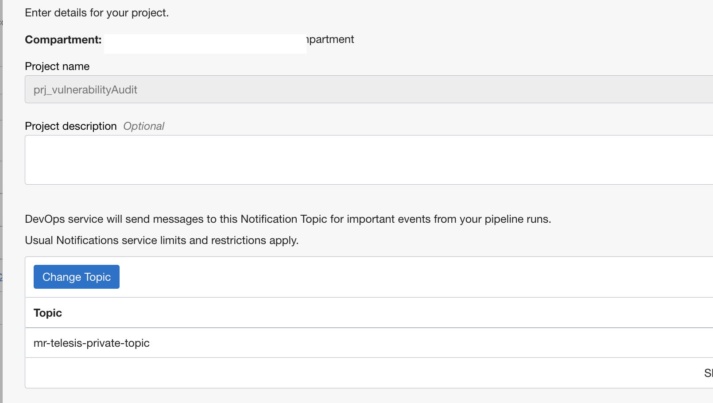
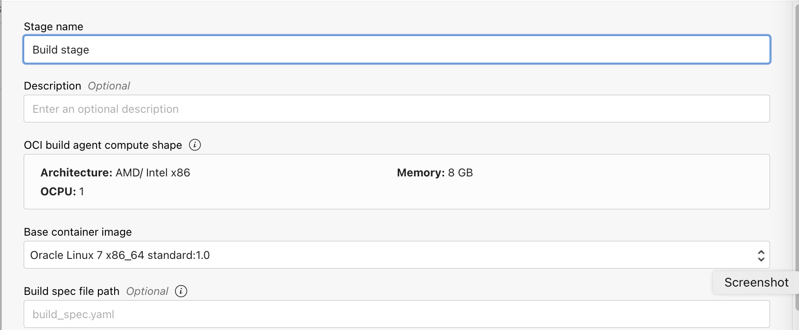
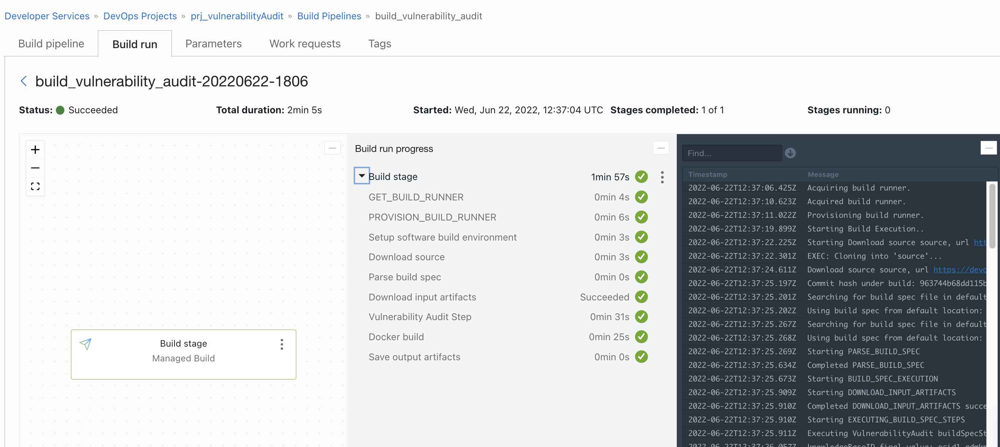
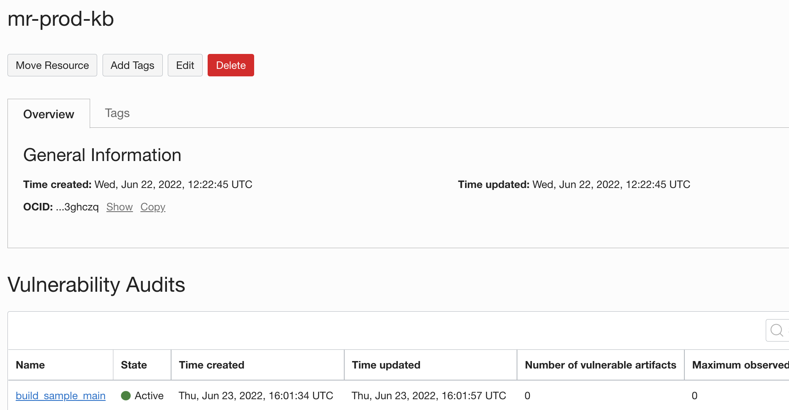
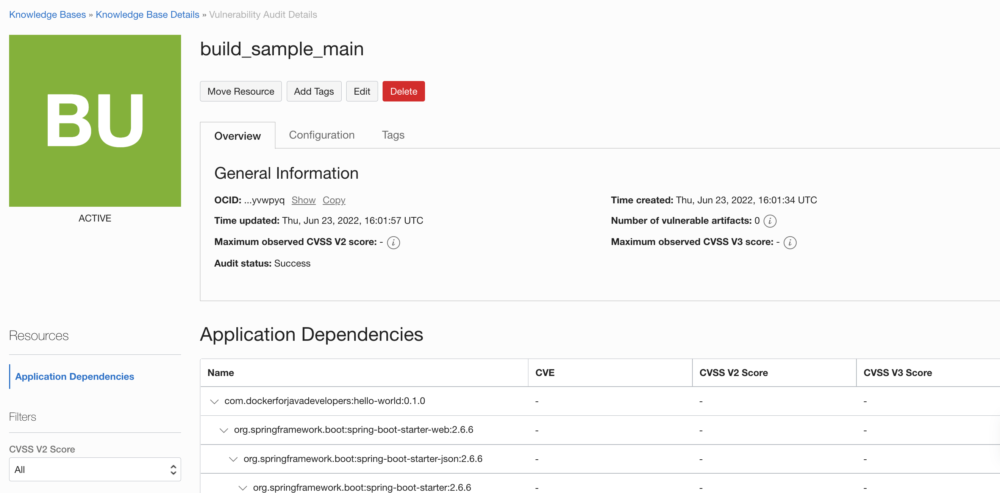
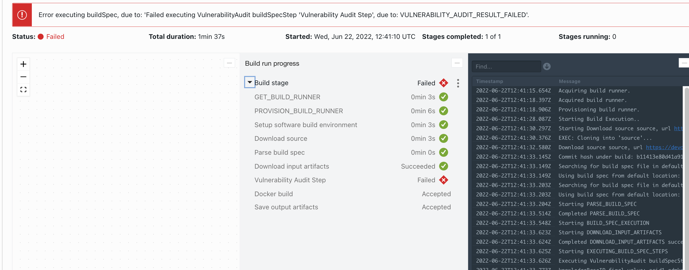

A sample illustration of Code Vulnerabilities for Maven packages
------

The Application Dependency Management (ADM) service provides you with an integrated vulnerability knowledge base that you can use from the Oracle Cloud Infrastructure (OCI) DevOps build pipelines to detect vulnerabilities in the packages used for the build.


Objective
---

- Create an OCI build pipeline with a sample java - maven-based application.
- Instantiate a vulnerability scan and demonstrate success and failure conditions.

Procedure to use the illustration
-------
- Create an OCI notification topic - https://docs.oracle.com/en-us/iaas/Content/Notification/Tasks/managingtopicsandsubscriptions.htm#createTopic
- Create a DevOps project - https://docs.oracle.com/en-us/iaas/Content/devops/using/create_project.htm#create_a_project.
- Associate with the notification topic.



- Enable the logging for the DevOps project.


- Create an OCI Dynamic group and add the below rules. - https://docs.cloud.oracle.com/iaas/Content/Identity/Tasks/managingdynamicgroups.htm

```markdown
ALL {resource.type = 'devopsbuildpipeline', resource.compartment.id = 'COMPARMENT OCID'}

ALL {resource.type = 'devopsrepository', resource.compartment.id = 'COMPARMENT OCID'}
```

- Create an OCI policy and add the below policies - https://docs.cloud.oracle.com/iaas/Content/Identity/Concepts/policies.htm

```markdown
Allow dynamic-group "NAME OF THE DynamicGroup" to manage repos in compartment "COMPARTMENT NAME"
Allow dynamic-group  "NAME OF THE DynamicGroup" to use ons-topics in compartment "COMPARTMENT NAME"
```

- Follow the below steps and create  a knowledge base - https://docs.oracle.com/en-us/iaas/Content/application-dependency-management/concepts/getting-started.htm

- In the `Oracle Cloud Console`, open the navigation menu, and click `Developer Services`. Under `Application Dependency Management`, click `Knowledge Bases`.
- Click Create Knowledge Base. You are prompted to enter information to describe the new knowledge base.
- Enter the following information:
  - Name: Give the knowledge base a name. For example, "Sample Knowledge Base".
  - Create in Compartment: Select the compartment from the compartment drop-down list.
  - (Optional) Provide a list of one or more unique tag key-value pairs to describe the knowledge base.


- Make a note of the `Knowledge base OCID`.


- Switch back to `OCI DevOps Project ` and create an OCI Code repo - https://docs.oracle.com/en-us/iaas/Content/devops/using/create_repo.htm#create_repo


- Push the content to OCI Code repo - https://docs.oracle.com/en-us/iaas/Content/devops/using/clone_repo.htm

- You may use other support version control repos as well (like Github.com,Bitbucket.com, Bitbucket Cloud etc). You may also need to adjust the policies according to connection and setup external connections accordingly - https://docs.oracle.com/en-us/iaas/Content/devops/using/create_connection.htm

- Create a new build pipeline. -  https://docs.oracle.com/en-us/iaas/Content/devops/using/create_buildpipeline.htm


- Under the build pipeline, add below `Parameters`

```markdown
VA_COMPARTMENT_OCID - Add the Compartment OCID as the default value.
KB_OCID - Add the OCID of the knowledge base as the default value
```


- Under the `Build pipeline` tab click `+` and add a `Managed Build` stage.


- Add necessary details.



- Click `Select` under `primary code repository` and associate with the code repo created.
- You can give any name as `source name`


- Keep all other values by default.
- Before we do the test, let us see what is with in the managed build, the instructions are defined under the [build_spec.yaml](build_spec.yaml) file.

  - `VulnerabilityAudit` is the step where we are assessing the application dependencies against the knowledge base and based on the  `maxPermissibleCvssV2Score` and `maxPermissibleCvssV3Score` values marking its success or failure.

```markdown
- type: VulnerabilityAudit
    name: "Vulnerability Audit Step"
    configuration:
      buildType: maven
      pomFilePath: ${OCI_PRIMARY_SOURCE_DIR}/pom.xml
      maxPermissibleCvssV2Score: 6.0
      maxPermissibleCvssV3Score: 7.0
    knowledgeBaseId: ${KB_OCID}
    vulnerabilityAuditCompartmentId: ${VA_COMPARTMENT_OCID}
    vulnerabilityAuditName: build_sample_${OCI_PRIMARY_SOURCE_SOURCE_BRANCH_NAME}
```
- Only if it's successful it will do the further steps as a docker image build.

Let's test
------------

- Switch to `Build pipeline` and click on `Start manual run`
- Wait for all the build steps to end, at this run, it will be successful.



- The execution is successful as we set the CvvsV2Score as 6 and CvssV3Score as 7 . To validate the dependency vulnerability scanning repo, switch to the `knowledge base` >`Vulnerability Audits` tab.



- Click and view the details against the `audit run`.



- Change the file [build_spec.yaml](build_spec.yaml) and update `maxPermissibleCvssV2Score` as `2.0` and `maxPermissibleCvssV3Score` as `3.0` .

```markdown

- type: VulnerabilityAudit
    name: "Vulnerability Audit Step"
    configuration:
      buildType: maven
      pomFilePath: ${OCI_PRIMARY_SOURCE_DIR}/pom.xml
      maxPermissibleCvssV2Score: 2.0
      maxPermissibleCvssV3Score: 3.0
    knowledgeBaseId: ${KB_OCID}
    vulnerabilityAuditCompartmentId: ${VA_COMPARTMENT_OCID}
    vulnerabilityAuditName: build_sample_${OCI_PRIMARY_SOURCE_SOURCE_BRANCH_NAME}
```
- Push the changed file back to `OCI Code repo` and re-run the `Build pipeline` using the `Start manual run` option.

- The build run will fail at the steps `Vulnerability Audit Step`.



- To validate the dependency vulnerability scanning repo, switch to the `knowledge base` >`Vulnerability Audits` tab.


Contributors
===========

- Author: Rahul M R.
- Collaborators: NA
- Last release: June 2022

